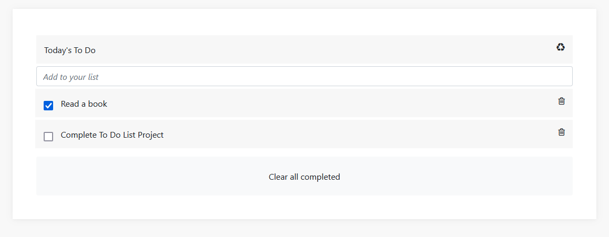

# To-Do-list-Application

> This is a team project in the Microverse second Module. The project is a To-Do-List application  were you are able to add and remove and mark completed tasks 




Our goal here is to Build a To-do list application with add, remove and checked feature from scratch using JavaScripts Click [here](https://abenezer-tilahun.github.io/To-Do-list-Application/) to get a live preview of the project

# Features implemented so far are:

- Responsive HTML page
- Integrated webpack
- dynamic to-do list dom manipulation
- Add a task to list [Hit enter key to add a new task]
- Edit a task to list [this is done on editable and hit enter key to save to list]
- Save current state to local-storage.
- Addition of unit test using Jest.

# Built With

- Lighthouse (An open-source, automated tool for improving the quality of web pages. It has audits for performance, accessibility, progressive web apps, SEO and more).
- Webhint (A customizable linting tool that helps you improve your site's accessibility, speed, cross-browser compatibility, and more by checking your code for best practices and common errors).
- Stylelint (A mighty, modern linter that helps you avoid errors and enforce conventions in your styles).
- ESlint (A mighty, modern linter that helps you avoid errors and enforce conventions in JavaScript codes)
- Webpack (Used for bundling JavaScript files for usage in a browser)
- Jest (A JavaScript testing framework designed to ensure correctness of any JavaScript codebase. It allows you to write tests with an approachable, familiar and feature-rich API that gives you results quickly.)

To get a local copy up and running follow these simple example steps.


# Prerequisites

The basic requirements for building the executable are:

- A working browser application (Google chrome, Mozilla Fire fox, Microsoft edge ...)
- VSCode or any other equivalent code editor
- Node Package Manager (For installing packages like Lighthous, webhint & stylelint used for checking for debugging bad codes before deployment)

# Getting Started

#### Cloning the project
```
git clone https://github.com/Abenezer-Tilahun/To-Do-list-Application.git<Your-Build-Directory>

cd To-Do-list-Application

npm install

npm run start
```

## Getting packages and debuging with Stylelint
```
npm install --save-dev stylelint@13.x stylelint-scss@3.x stylelint-config-standard@21.x stylelint-csstree-validator@1.x
```
##### For validation detection using Stylelint Run
```
npx stylelint "**/*.{css,scss}"
```
##### from parent source directory

## Getting packages and debuging with ESlint
```
npm install npm install --save-dev eslint@7.x eslint-config-airbnb-base@14.x eslint-plugin-import@2.x babel-eslint@10.x
```
##### For validation detection using Stylelint Run
```
npx eslint .
```
##### from parent source directory

## Getting packages and debuging with Webhint
```
npm init -y
npm install --save-dev hint@6.x
```
##### For validation detection using Webhint Run
```
npx hint .
```
## Unit Testing

You can find each unit test cases in the Test folder located in the parent source directory of the project. you can create your own custom unit test and test it by running

```
npx run test
```
This should run all unit test found in the application.test.js from the Test folder.
 ## 🤝 Contributing

Feel free to check the [issues page](../../issues/).

## Authors

👤 **Author1**

- GitHub: [@githubhandle](https://github.com/Abenezer-Tilahun)
- Twitter: [@twitterhandle](https://twitter.com/AbenezerTilah11)
- LinkedIn: [LinkedIn](linkedin.com/in/abenezer-tilahun-4b4b43137)

👤 **Author1**

- GitHub: [@githubhandle](https://github.com/vickymarz)
- Twitter: [@twitterhandle](https://twitter.com/Vicky_mars)
- LinkedIn: [LinkedIn](https://www.linkedin.com/in/okoroji-victor-ebube-8791741a0/)

## Show your support

Give a ⭐️ if you like this project!

## Acknowledgments

- Microverse
- My coding partners(@vickymarz)

## 📝 License

This project is [MIT](./MIT.md) licensed.